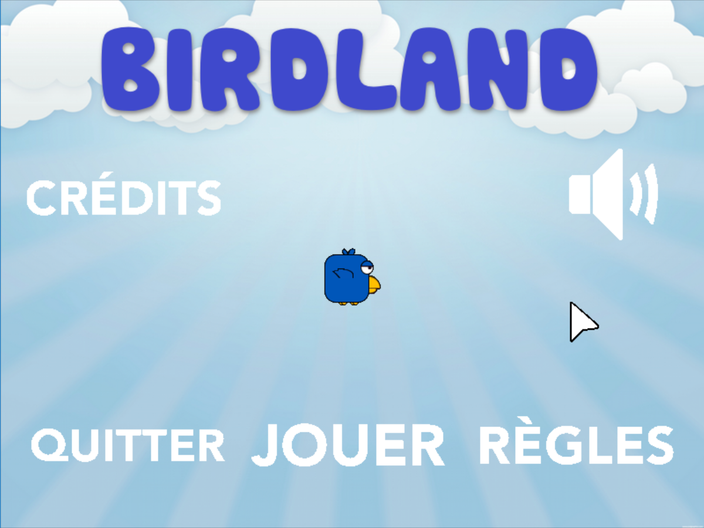
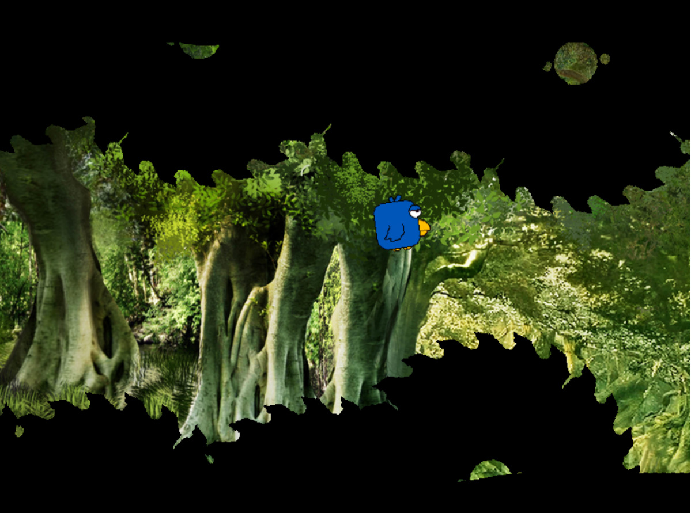

First year project.
Game developed in C with graphics library Allegro 4.4.2.
Player controls a little bird that flies and has to navigate through a maze of obstacles of increasing difficulty.
Player is helped by checkpoints and bonuses that he can pick up while flying.

Credits:  Gabriel M.R. , Alexandre T. , Adrian C.

---------
Instructions to compile and run:
You need to install and link allegro 4.4.2
